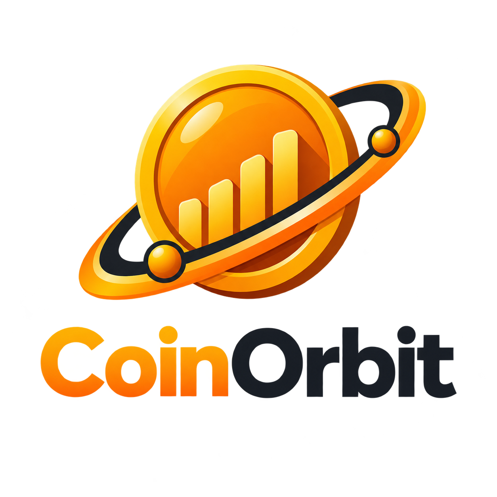

<div align="center">



# CoinOrbit

Dashboard para consulta, análise e visualização de dados do mercado de criptomoedas.

</div>

A Python application that retrieves real-time cryptocurrency information using the CoinGecko API.

This project was developed to practice API consumption, JSON manipulation, project organization, and Git while building my Data Science portfolio.

---

## ✨ Features

* 🔍 Search any cryptocurrency by name
* 💰 Display the current price in BRL
* 📈 Show the 24-hour price variation
* 🏦 Display the market capitalization
* 🧩 Organized modular architecture
* ⚡ Fast and lightweight

---

## 🛠️ Technologies

* Python 3
* Requests
* CoinGecko API
* Git
* GitHub

---

## 📂 Project Structure

```text
crypto-tracker/
│
├── src/
│   ├── __init__.py
│   ├── api.py
│   ├── config.py
│   └── utils.py
│
├── .gitignore
├── main.py
├── requirements.txt
└── README.md
```
## 🚀 Installation

Clone the repository:

```bash
git clone https://github.com/LeoPedrosoSantos/crypto-tracker.git
```

Go to the project folder:

```bash
cd crypto-tracker
```

Install the dependencies:

```bash
pip install -r requirements.txt
```

Run the application:

```bash
python main.py
```

---

## 📸 Preview

*(Coming soon)*

A screenshot or GIF demonstrating the application will be added after the first stable version.

---

## 🎯 Future Improvements

- Top 10 cryptocurrencies
- Search by symbol (BTC, ETH...)
- Export data to CSV
- Search history
- Compare multiple cryptocurrencies
- Interactive charts
- Streamlit web interface
- Better error handling

---

## 📚 What I Learned

This project helped me practice:

* Consuming REST APIs
* Working with JSON responses
* Creating reusable Python modules
* Organizing project architecture
* Version control with Git and GitHub

---

## 👨‍💻 Author

Leonardo Santos

GitHub: https://github.com/LeoPedrosoSantos
